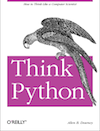

# Learn Python

Read Allen Downey's [Think Python](http://www.greenteapress.com/thinkpython/) for getting up to speed with Python 2.7 and computer science topics. It's completely available online, or you can buy a physical copy if you would like.

<a href="http://www.greenteapress.com/thinkpython/"></a>

For quick and easy interactive practice with Python, many people enjoy [Codecademy's Python track](http://www.codecademy.com/en/tracks/python). There's also [Learn Python The Hard Way](http://learnpythonthehardway.org/book/) and [The Python Tutorial](https://docs.python.org/2/tutorial/).

---

###Q1. Lists &amp; Tuples

How are Python lists and tuples similar and different? Which will work as keys in dictionaries? Why?

> Python lists and tuples are similar in that they are both container sequences that can hold items of various types (including other lists and tuples), with the ability to address items by a 0-based positional index. The primary distinction is that lists are mutable whereas tuples are not. This means that lists are not hashable, but tuples are. Therefore tuples work as keys in dictionaries, but lists do not.

> In addition, tuples are often used to represent data records, where item position is significant. For example, if tuples were used to represent students, each tuple would contain the same number of items, and the items would be given in the same order for each tuple, where the first item might be the student ID.

---

###Q2. Lists &amp; Sets

How are Python lists and sets similar and different? Give examples of using both. How does performance compare between lists and sets for finding an element. Why?

> Python lists and sets are similar in that they are collections of mixed data, and both are mutable. However, there are a number of notable differences:

> * Each element of a set is unique, whereas a list may contain duplicates.
> * Elements of a set are unordered, whereas elements of a list are ordered.
> * Elements of a list are directly accessible via a 0-based index, whereas set elements are not directly accessible.
> * A set may contain only immutable elements, whereas there is no restriction on list elements.

> Here is an example of using a list:

>     >>> l = [99, "luftballoons", ("a", 1), 99]
>     >>> l
>     [99, 'luftballoons', ('a', 1), 99]
>     >>> l + [{'major-version': 3}]
>     [99, 'luftballoons', ('a', 1), 99, {'major-version': 3}]
>     >>> l[1]
>     'luftballoons'

> Here is an example of using a set:

>      >>> s = {99, "luftballoons", "a", 1, 99}
>      >>> s
>      {1, 99, 'a', 'luftballoons'}
>      >>> s | {'a', 'b'}
>      {1, 99, 'a', 'b', 'luftballoons'}
>      >>> s - {1}
>      {99, 'a', 'luftballoons'}

> In general, finding an element in a set is faster than finding an element in a list because elements in a set are hashed, and can thus be found in constant time. The average time to find an element in a list grows as the size of the list grows (linearly for unsorted lists, logarithmically for sorted lists).

---

###Q3. Lambda Function

Describe Python's `lambda`. What is it, and what is it used for? Give at least one example, including an example of using a `lambda` in the `key` argument to `sorted`.

>> REPLACE THIS TEXT WITH YOUR RESPONSE

---

###Q4. List Comprehension, Map &amp; Filter

Explain list comprehensions. Give examples and show equivalents with `map` and `filter`. How do their capabilities compare? Also demonstrate set comprehensions and dictionary comprehensions.

>> REPLACE THIS TEXT WITH YOUR RESPONSE

---

###Complete the following problems by editing the files below:

###Q5. Datetime
Use Python to compute days between start and stop date.
a.

```
date_start = '01-02-2013'
date_stop = '07-28-2015'
```

>> REPLACE THIS TEXT WITH YOUR RESPONSE

b.
```
date_start = '12312013'
date_stop = '05282015'
```

>> REPLACE THIS TEXT WITH YOUR RESPONSE

c.
```
date_start = '15-Jan-1994'
date_stop = '14-Jul-2015'
```

>> REPLACE THIS TEXT WITH YOUR RESPONSE

Place code in this file: [q5_datetime.py](python/q5_datetime.py)

---

###Q6. Strings
Edit the 7 functions in [q6_strings.py](python/q6_strings.py)

---

###Q7. Lists
Edit the 5 functions in [q7_lists.py](python/q7_lists.py)

---

###Q8. Parsing
Edit the 3 functions in [q8_parsing.py](python/q8_parsing.py)


